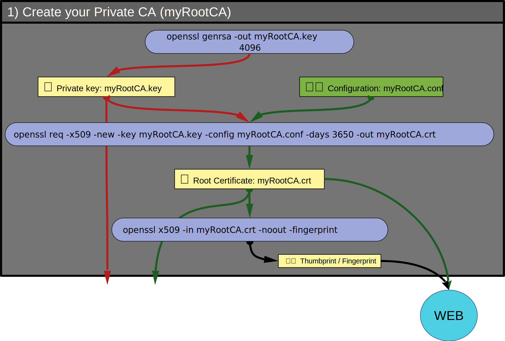

# 1) Create your private _Certification-Authority_ (CA)

### 👉 background and warning

A certification authority (CA) is a company that **validates** the digital identity of websites and email addresses, or the identity of companies and individuals.
After more or less thorough **verifications/investigations** it issues you with a digital certificate that certify the authenticity of who you claim to be.
You have to pay this company for that. As the certificate is only valid for a limited period, you also pay to renew it.
A company providing this service to the general public is called a _**public CA**_.

The good news is that you can create your own _**private CA**_ at no cost.
The downside is that the certificates generated by a private CA will not have the trust of Google Chrome, Microsoft Windows or internet users in general.
So, using a private CA has strong limitations.

However, there are some contexts where using a private CA is justified. **Code signing** is one of them:
- testing, training
- distribution of software developed in-house within a company. In this case we talk about _internal_ CA (this is a common practice)
- distribution of software to a community of experienced/informed users (such as developers using GitHub, GitLab, BitBucket ... :-)

**You have been warned. Let's go!**

## 👀 Visual overview



## ⚙ 1/4 Generate the Private-Key of your private CA

This command generates the private key (.key) for your private CA

```
openssl genrsa -out myRootCA.key 4096
```

4096 is the size of the RSA key. Usualy 2048 or 4096.
8192 is possible, but makes operations more CPU-intensive and therefore slower.

Add `-aes256` after `genrsa` to encrypt this private key.
You will be prompted for a passphrase during encryption, and you will be asked
for this passphrase each time you use this private key.
This passphrase must be between 4 and 1023 characters long.

🕮 Manual for [openssl genrsa](https://docs.openssl.org/master/man1/openssl-genrsa/)

## ✏️ 2/4 Configuration `myRootCA.conf`

Now, you need to create a Certificate (.crt) giving you the right to act as a CA.<br/>
You are a good guy but there is no public CA to delegate you this right,
so you will self-sign this Certificate with your private key.
There is nothing bad here. All public root CAs are self-signed.

For testing or trainning this is not very important, but for a company or a community
it must be clear that this certificate is a **private CA dedicated to Code Signing**.

Here a template for the configuration file [`myRootCA.conf`](https://github.com/JEAYNE/Self-Signing_Code/blob/main/demo/conf/myRootCA.conf)
used to generate the Certificate.<br/>
👉 You must modify each field of the `[ ca_dn ]` section  to match the identity of your private CA.
```
[ ca_dn ]
countryName            = XX
stateOrProvinceName    = MY-ORG_STATE
localityName           = MY-ORG_CITY
organizationName       = MY-ORG
organizationalUnitName = MY-ORG CA unit
commonName             = MY-ORG Private Code Signing CA - V1
emailAddress           = CA-team@MY-ORG.COM

##### There is no reason to change anything below this line ####

[ req ]
default_md         = sha512
utf8               = yes
string_mask        = utf8only
prompt             = no
distinguished_name = ca_dn
x509_extensions    = ca_extensions

[ ca_extensions ]
basicConstraints       = critical, CA:true, pathlen:0
keyUsage               = critical, keyCertSign, cRLSign
extendedKeyUsage       = critical, codeSigning
subjectKeyIdentifier   = hash
authorityKeyIdentifier = keyid:always, issuer
```

> Notes:<br/>
> \- The parameter ‘pathlen:0’ prevents this CA from being part of a chain of CAs.
It is the root and the unique CA of the chain.<br/>
> \- The `extendedKeyUsage` restrict this CA to code signing.<br/>
> These limitations will reassure administrators, who will not view this private CA as a Trojan horse.

🕮 Manual for [openssl configuration](https://docs.openssl.org/master/man5/config/)

## ⚙ 3/4 Generate the Certificate of your private CA

Generate the certificate `myRootCA.crt` with information from `myRootCA.cfg` and self-sign the certificate with the private key `myRootCA.key`

```
openssl req -x509 -new -key myRootCA.key -config myRootCA.cfg -days 3650 -out myRootCA.crt
```
3650 is the period (in days) during which this CA certificate can be used.

🕮 Manual for [openssl req](https://docs.openssl.org/master/man1/openssl-req/)

# 🔍 Verify

Private Keys (.key) and Certificates (.cer) are encoded with [DER](https://en.wikipedia.org/wiki/X.690#DER_encoding) (Distinguished Encoding Rules)
and then with [PEM](https://en.wikipedia.org/wiki/Privacy-Enhanced_Mail) (Privacy-Enhanced Mail)
the result is always a text file. If you are curious you can load them in a text editor but it is better to use these commands:

```
openssl rsa  -in myRootCA.key -check -noout
```
- Must display `RSA key ok`

```
openssl x509 -in myRootCA.crt -text  -noout
```
- The values of `Issuer` and `Subject` must be identical.
- The dates of `Not Before` and `Not After` must be inline with the value of the `-days` parameter.
- The values of `X509v3 Subject Key Identifier` and `X509v3 Authority Key Identifier` must be identical.
- The value of `X509v3 Basic Constraints` must be `critical CA:TRUE, pathlen:0`
- The value of `X509v3 Extended Key Usage` must be `critical Code Signing`

## 📌 4/4 Publish !

_It is strongly recommended that you postpone this step until you have
a thorough understanding of the entire certification and code signing chain_

To verify your signature in your binaries, Windows will need to know the public key of your private CA.
This key is included in the CA certificate `myRootCA.crt`.

You must therefore publish **`myRootCA.crt`** and its **thumbprint** on the same page.
The url used for this publication must be clearly owned by MY-ORG.
and you should strongly encourage your users to check, during the installation, that the thumbprint of the
certificate being installed matches the thumbprint published on the download page.

This command will give you the **thumbprint** (term used by Windows, but called **fingerprint** by openssl):

```
openssl x509 -in myRootCA.crt -noout -fingerprint
```

> Note:
> Openssl uses this format:<br/>
> \- uppercase, 20 pairs: `E3:75:EF:9C:A9:A4:72:B7:66:4C:40:94:DB:8C:D2:AD:1E:49:D6:9D` <br/>
> Windows displays the thumbprint with two formats:<br/>
> \- uppercase, 5 groups: `E375EF9C A9A472B7 664C4094 DB8CD2AD 1E49D69D` <br/>
> \- lowercase, 1 string: `e375ef9ca9a472b7664c4094db8cd2ad1e49d69d` <br/>

👉 The **single URL**, your **CA certificate** and its **thumbprint** are the three pillars of trust between you and your users.

As an example, see how this single url looks like for [my own private CA](https://github.com/JEAYNE/Private.Code.Signing.CA/).

<hr/>

### [⇐ Where to find tools](0_Where-To-Find-Tools.md) < [🏠](index.md) > [Create your Certification-Request ⇒](2_Create-Your-Certification-Request.md)
