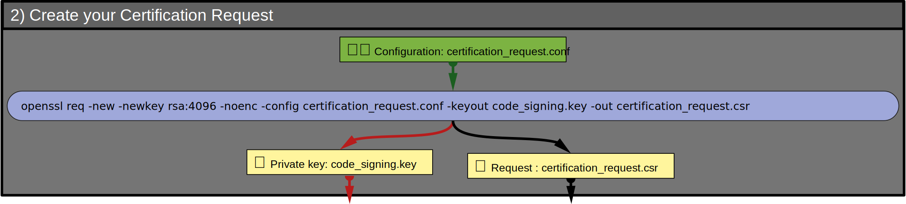

# 2) Create your _Certification-Request_

As a developer you wish to have your identity validated by a CA so that you can sign  the programmes
you create and distribute. To do this, you have to create a Certification-Request (.csr), and send it
for certification to a CA. This request is the same regardless of the type (public or private) of CA that will certify it.

_Note: we are referring here to a ‘Certification Request’, but the term commonly used is ‘**C**ertificate **S**igning **R**equest’.
But, in the context of code signing, this dual use of the word ‘signing’ can be confusing.
We will keep it for the final step, when you sign your code._

## 👀 Visual overview



## 1/2 ✏️ Configuration `certification_request.conf`

Here a template for the configuration file [`certification_request.conf`](https://github.com/JEAYNE/Self-Signing_Code/blob/main/demo/conf/certification_request.conf)
used to generate the Certification-Request<br/>
👉 You must modify each field of the `[ dev_dn ]` section to match your identity as a developer.

```
[ dev_dn ]
countryName            = XX
stateOrProvinceName    = MY-ORG_STATE
localityName           = MY-ORG_CITY
organizationName       = MY-ORG
organizationalUnitName = MY-ORG DEV unit
commonName             = MY-ORG
emailAddress           = DEV-team@MY-ORG.COM

##### There is no reason to change anything below this line ####

[ req ]
default_md         = sha512
utf8               = yes
string_mask        = utf8only
prompt             = no
distinguished_name = dev_dn
req_extensions     = codesign_ext

[ codesign_ext ]
keyUsage             = critical, digitalSignature
extendedKeyUsage     = critical, codeSigning
subjectKeyIdentifier = hash
```

🕮 Manual for [openssl configuration](https://docs.openssl.org/master/man5/config/)

## 2/2 ⚙ Certification Request

Here the command used the create the `certification_request.csr`

```
openssl req -new -newkey rsa:4096 -noenc -keyout codes_igning.key -config certification_request.conf -out certification_request.csr
```

🕮 Manual for [openssl req](https://docs.openssl.org/master/man1/openssl-req/)

## 🔍 Verify

Use this command to inspect the request generated:
```
openssl req -in certification_request.csr -text -verify -noout
```

Normally, after verification, you would send this request to a public CA and wait to receive the certificate signed by the CA.<br/>
However, the main objective of this tutorial is to submit this request to your private CA.

<hr/>

### [⇐ Create your Certification-Autority](1_Create-Your-Certification-Authority.md) < [🏠](index.md) > [Certify your Certification-Request ⇒](3_Certify-Your-Certification-Request.md)
