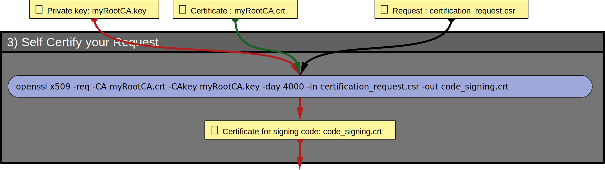

# 3) Self Certify your _Certification-Request_

You are acting here as a CA. You have to certify that the information contained in `certification_request.csr` is valid.

## 👀 Visual overview



## ⚙ 1/1 Certification

Note: As a CA dedicated to code signing, you know that the certificate will be used to sign code because when you run
```
openssl req -in certification_request.csr -text -verify -noout
```
you see:
```
Requested Extensions:
    X509v3 Key Usage: critical
        Digital Signature
    X509v3 Extended Key Usage: critical
        Code Signing
```

If, as a CA, the information in the request is valid, run this command to generate the certificate:

```
openssl x509 -req -CA myRootCA.crt -CAkey myRootCA.key -days 4000 -in certification_request.csr -out code_signing.crt
```
4000 is the period (in days) during which the certificate can be used to sign code. With a public CA the period does not exceed 3 years.

🕮 Manual for [openssl x509](https://docs.openssl.org/master/man1/openssl-x509/)

## 🔍Verify

The resulting certificate `code_signing.crt` can be inspected with this command:

```
openssl x509 -in code_signing.crt -text -noout
```

<hr/>

### [⇐ Create your Certification-Request](2_Create-Your-Certification-Request.md) < [🏠](index.md) > [Bundle Key and Certificate ⇒](4_Bundle-Key-And-Certificate.md)
