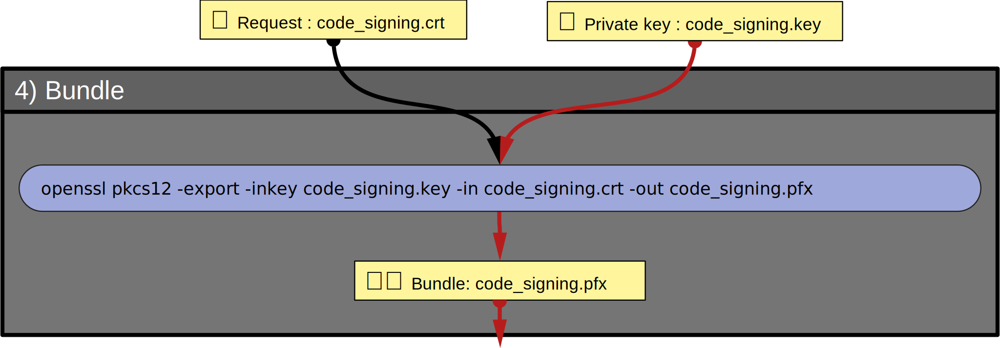

# 4) Bundle key and certificate

This step bundle two files in order to meet the requirements of `signtool.exe`:
- `code_signing.key` (private key generated during the generation of the Certification-Request)
- `code_signing.crt` (Certificate generated by our CA upon signing the Certification-Request)

The resulting file `code_signing.pfx` uses the format [pkcs#12](https://fr.wikipedia.org/wiki/PKCS12).

## 👀 Visual overview



## ⚙ 1/1 Bundle

The command that performs this task is:

```
openssl pkcs12 -export -inkey code_signing.key -in code_signing.crt -out code_signing.pfx
```

You will be prompted for two passwords:
- "Export Password" is the (optional) password to use for the final file `code_signing.pfx`
- "Import Password" is the password used (if any) when creating the Certification-Request `certification_request.csr`

👉 The resulting file is VERY important:
- Only this file is mandatory to sign your code.
- It contains the private key of the certificate used to sign your code

🕮 Manual for [openssl pkcs12](https://docs.openssl.org/master/man1/openssl-pkcs12/)

## 🔍 Verify

You can inspect this .pfx file with the command:
```
openssl pkcs12 -info -nokeys -in code_signing.pfx
```

<hr/>

### [⇐ Certify your Certification-Request](3_Certify-Your-Certification-Request.md) < [🏠](index.md) > [Sign your Code ⇒](5_Sign-Your-Code.md)
