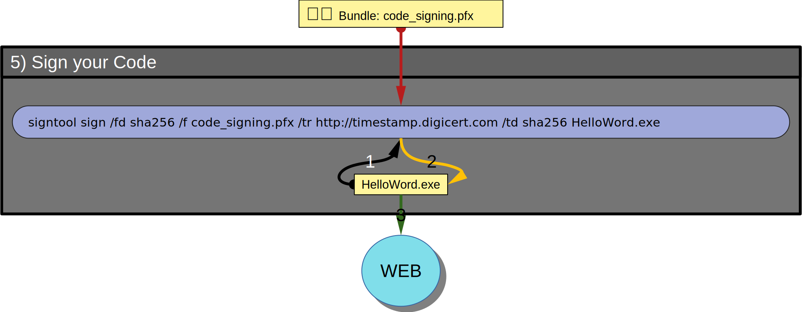
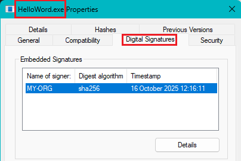
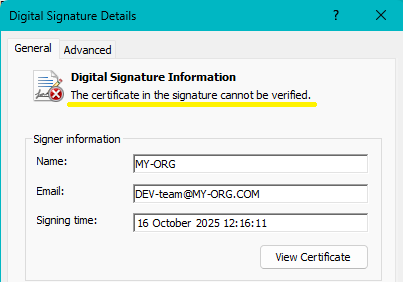
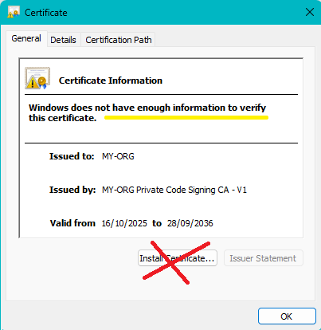
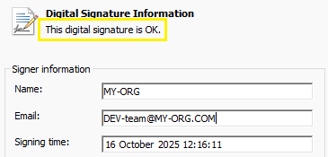
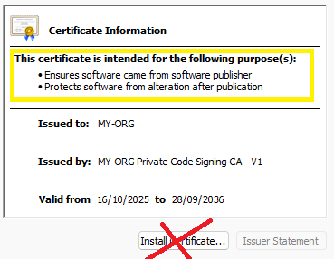
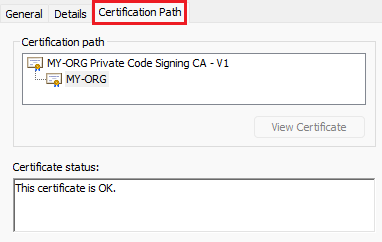

# 5) Sign your code

This last step is the one you will perform most often.
It requires two files:
- the file to be signed  (.exe .msi .cab ...) before publication
- the _secret_ file code_signing.pfx

## 👀 Visual




## ⚙ 1/1 Sign

Use this command to sign the file `HelloWord.exe`

```
signtool sign /debug /fd sha256 /f code_signing.pfx /tr http://timestamp.digicert.com /td sha256 HelloWord.exe
```

Note: The original `HelloWord.exe` file is overwritten with its signed version.

`/tr http://timestamp.digicert.com` is important. It returns a certified timestamp that will be included with the signature.
This allows the signature to be accepted even after the certificate included in `code_signing.pfx` has expired.<br/>
These url can also be used: <br/>
• `http://time.certum.pl`<br/>
• `http://timestamp.sectigo.com`<br/>
• `http://timestamp.globalsign.com/scripts/timstamp.dll`

👉 To avoid being banned, space out your requests by approximately 15 seconds ;-)

🕮 Manual for [signtool sign](https://learn.microsoft.com/fr-fr/windows/win32/seccrypto/signtool#sign-command-options)

## 🔍 Verify (level 1)

1. Right click on the signed file (`HelloWord.exe`) > click on 'Properties' > click on the 'Digital Signatures' tab<br/>
   <br/>

2. Select the '_signer_' (it is you as a developer) > Click on 'Details'<br/>
   <br/>
   Notes:<br/>
   - The certificate in the Countersignatures section (not in the picture) is the one for the timestamp.<br/>
   - '_The Certificate in the signature cannot be verified_' because your private CA certificate is not (yet) know by Windows.

   If you click on the 'Advanced' tab you can see who is the 'Issuer': you as a CA.

3. Click on View 'Certificate'<br/>
   <br/>
   On this popup you see your _private RootCA_ and the _Code Signing Certificate_<br/>
   If you click on the 'Details' tab you will see all fields of the certificate.

DO NOT click on 'Install Certificate'.

## 🔍 Verify (level 2)

Now, as a user of your software, install the private CA certificate `myRootCA.crt` published by MY-ORG
(as explained here) and check again the Digital Signatures of `HelloWord.exe`. You should get this:



Click on 'View Certificate'



DO NOT click on 'Install Certificate'.<br/>
Click on the 'Certification Path' tab




if this verification was successful, this means:
- your private CA certificate (`myRootCA.crt`) is valid 🡆 It can be published
- your certificate for signing code (`code_signing.pfx`) is valid 🡆 It must stay secret
- HelloWord.exe has a valid signature. 🡆 It can be published.


## 📌 Last but not least

Users of your signed files will have to import the `myRootCA.crt` file into their Windows key store.
You must therefore publish **`myRootCA.crt`** and its **thumbprint** .

See last paragraph of **[step 1](1_Create-Your-Certification-Authority.md#44-publish-)** for more details.

<hr/>

### [⇐ Bundle key and certificate](4_Bundle-Key-And-Certificate.md) < [🏠](index.md) |
