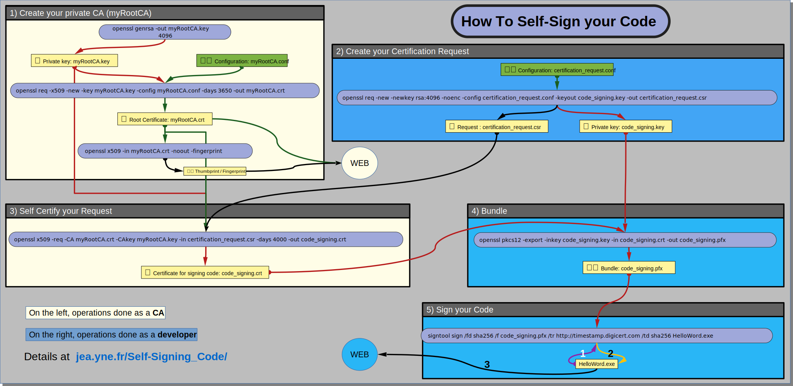

# Self-Signing your Code
**A step by step description of how to self-sign your code on Windows.**

_This documentation is licensed under the Creative Common [BY-NC-SA](https://creativecommons.org/licenses/by-nc-sa/4.0/) 4.0 license._

# 📃 Index
Steps 1,2,3 and 4 use [OpenSSL](https://openssl.org/).
Step 5 uses [SignTool](https://learn.microsoft.com/en-us/windows/win32/seccrypto/signtool) 
or [osslSignCode](https://github.com/mtrojnar/osslsigncode). 
Find out [Where to find](0_Where-To-Find-Tools.md) these tools.

1. Create your private [Certification Authority](1_Create-Your-Certification-Authority.md) (CA)
2. Create your [Certification Request](2_Create-Your-Certification-Request.md)
3. [Certify](3_Certify-Your-Certification-Request.md) your request with your private CA
4. [Bundle](4_Bundle-Key-And-Certificate.md) private key and certificate
5. [Sign](5_Sign-Your-Code.md) your code with SignTool (or osslSignCode)

👉 These [5 scripts](https://github.com/JEAYNE/Self-Signing_Code/tree/main/demo)
implement what is explained in the 5 steps above.

# 👀 Visual summary
⛶ [Full screen](files/0_Self-Signing_Code.svg)

